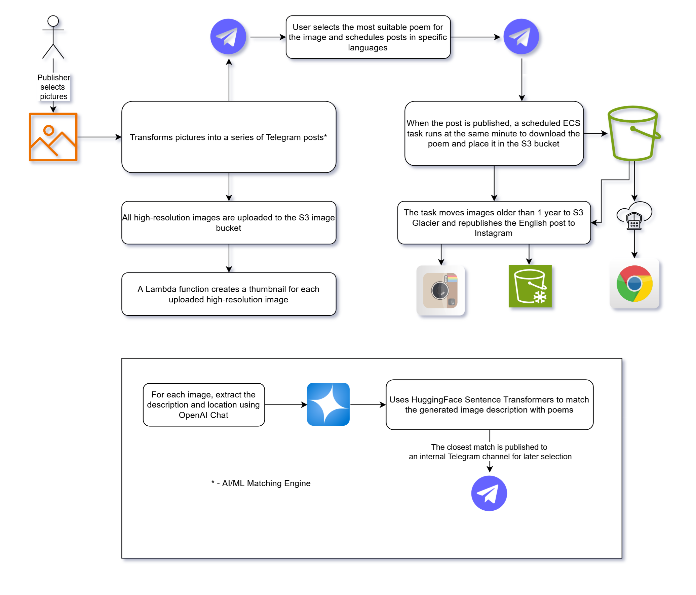

# Dayly Image

This project simplifies management of telegram channels and s3 site where I publish my images.

## Features
- Finds by description of an image a poem on russian and ukranian
- Publishes posts to the telegram
- Uploads the images to s3 site
- On moment of publish on telegram downloads the poem to s3 site
- Creates thumbnail