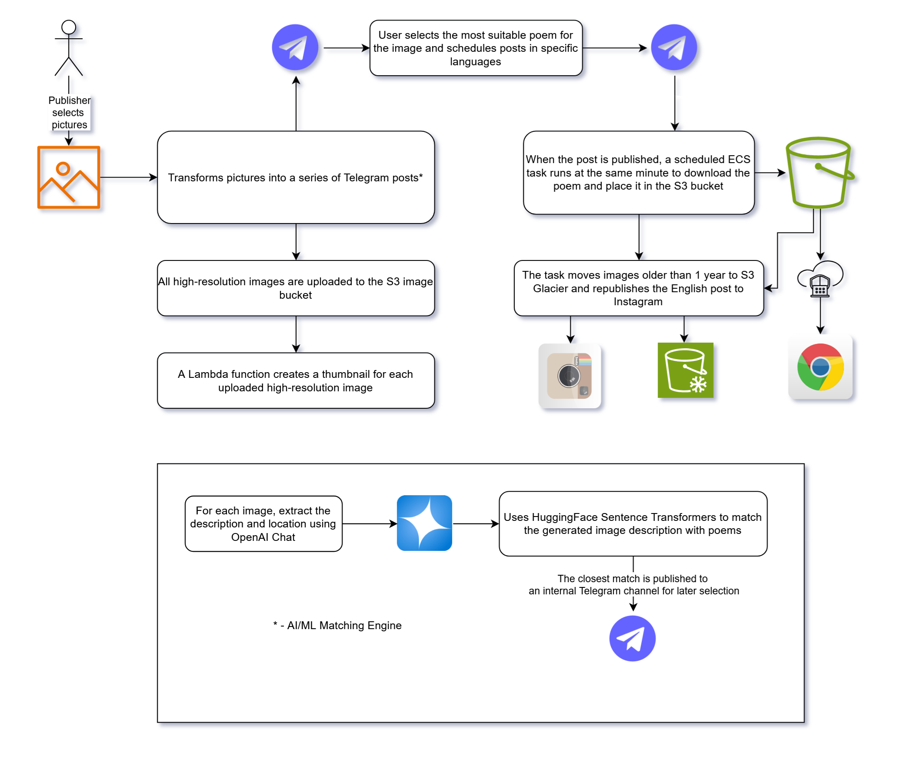

# Daily Image

This project streamlines the management of Telegram channels and an S3-hosted website used to publish curated images with matching poems.

## Features

- Uses AI to extract descriptions and locations from uploaded images
- Finds the most relevant poems in English, Russian and Ukrainian using semantic search
- Publishes posts (image + poem) to Telegram in multiple languages
- Uploads all high-resolution images to an S3-hosted website
- Automatically generates image thumbnails via AWS Lambda
- At the moment of Telegram publishing, downloads the selected poem and saves it to S3
- Archives images older than 1 year to S3 Glacier
- Republishes selected posts to Instagram

## Publishing performance

`publish_best_poem.py` prints an aggregate timing summary after each run. Timing is
enabled by default, and stages slower than five seconds are printed immediately.
Set `PUBLISH_TIMING=0` to hide timings, or change the live threshold with
`PUBLISH_TIMING_SLOW_THRESHOLD_SECONDS`.

The expensive selection loops are configurable without code changes:

- `PUBLISH_INITIAL_LOOPS` (default `2`)
- `PUBLISH_IMPROVEMENT_LOOPS` (default `1`)
- `PUBLISH_INITIAL_BATCH_SIZE` (default `10`)
- `PUBLISH_IMPROVEMENT_BATCH_SIZE` (default `20`)
- `PUBLISH_TOP_SIZE` (default `5`)
- `OLLAMA_KEEP_ALIVE` (default `10m`)

For the fastest semantic-only selection, set both loop counts to `0`. The normal
defaults retain generated-tale refinement while using fewer model calls.

The first-ranked poem is recorded after successful publication and cannot rank
first again for 14 days. It may still appear in a lower position during that
window. Dry runs do not change this cooldown history.
